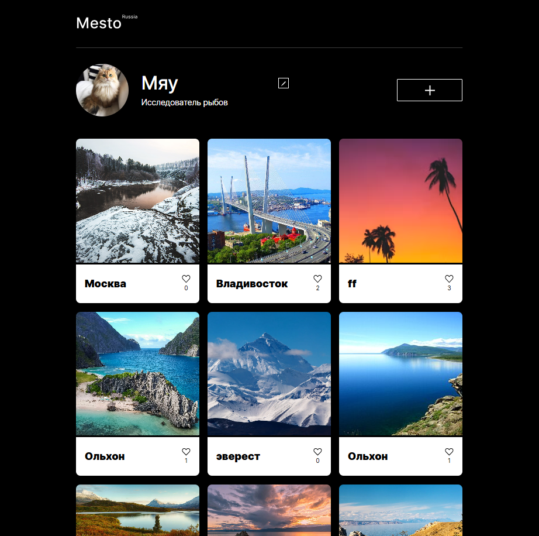
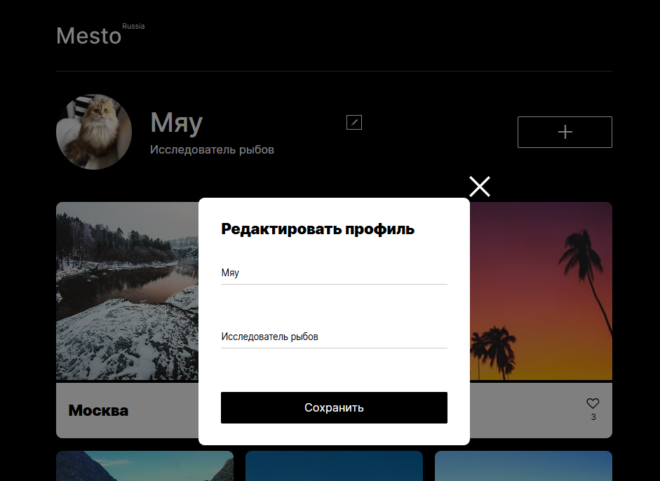
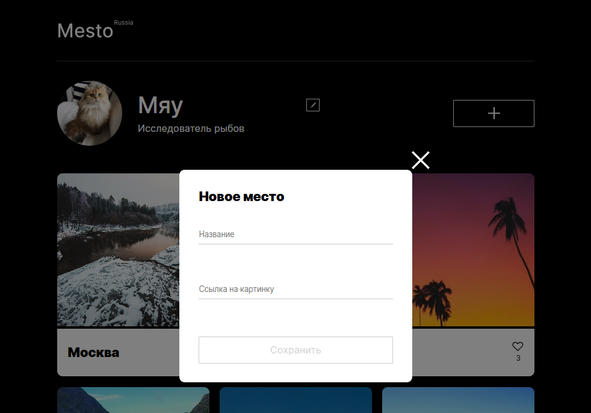
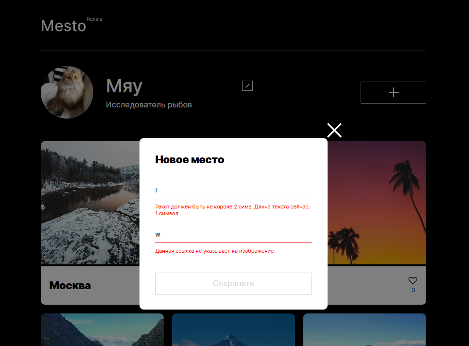

## 
 

## *Mesto - интерактивная страница, где можно добавлять и удалять фотографии, ставить лайки.*

### Проектные задачи:

- Создание карточки с помощью шаблона и вывод ее на страницу.
- Реализация работы модальных окон.
- Добавление возможности редактирования профиля.
- Реализация формы добавления карточки пользователем.
- Добавление возможность поставить лайк карточке.
- Разработка валидации всех форм.
- Подключение интерфейса к API.
- Публикация сайта на сервере.

### Функционал

#### Страница

#### Модальные окна
- При клике по крестику в правом верхнем углу модальное окно закрывается.
- При клике по оверлею модальное окно закрывается, при этом нажатие внутри модального окна не приводит к закрытию.
- При нажатии клавиши Esc модальное окно закрывается.

#### Редактирование профиля 

- При нажатии на кнопку редактирования открывается модальное окно редактирования профиля.
- При открытии модального окна редактирования профиля в поля формы подставляются данные пользователя со страницы и очищаются ошибки валидации, которые могли остаться с прошлого открытия.
-При нажатии кнопки «Сохранить» отправляется запрос сохранения данных на сервер. При успешном его выполнении модальное окно закрывается, а данные подставляются на страницу.
- Если модальное окно редактирования профиля закрывается нажатием на крестик, кликом на оверлей или нажатием Esc, то введённые в поля формы данные не сохраняются.
- При наведении указателя мыши на аватар, на нём появляется иконка редактирования, а при клике открывается модальное окно с формой редактирования аватара.
- При нажатии кнопки «Сохранить» в форме редактирования аватара отправляется запрос сохранения данных на сервер. При успешном его выполнении модальное окно закрывается, а аватар обновляется на странице.

#### Добавление новых карточек

- При нажатии на кнопку «+» открывается модальное окно добавления карточки.
- При нажатии на кнопку «Сохранить» отправляется запрос на добавление карточки на сервер. - При успешном его выполнении в начало списка карточек добавляется новая с введенными в форму данными.
- После добавления карточки модальное окно закрывается и форма очищается.

#### Карточка
- Кнопка лайка имеет состояние, зависящее от того поставил ли лайк пользователь,
отображается количество лайков.
- При клике на изображение карточки открывается модальное окно с отображением карточки и подписью.
- Кнопка удаления отображается только на карточках принадлежащих пользователю.
- При клике на кнопку удаления карточки открывается окно подтверждения.
- После нажатия на кнопку подтверждения отправляется запрос на сервер, и при его успешном завершении карточка удаляется со страницы, а окно подтверждения закрывается.

#### Влидация форм:

- Если поле ввода не проходит валидацию, то под ним отображается текст ошибки.
- Поля «Имя» и «О себе» формы редактирования профиля и поле «Название» формы добавления карточки валидируются с помощью регулярного выражения.
- Если поле ввода не проходит валидацию регулярным выражением, показывается кастомный текст ошибки.
- Если хотя бы одно из полей формы не прошло валидацию, то кнопка отправки формы не неактивна.

#### Взаимодействие с сервером:
- Рреализованы запросы: получение данных пользователя и карточек, обновление данных пользователя, обновление аватара пользователя, запросы добавления, удаления и лайка карточек
- Карточки отображаются на странице только после получения _id пользователя.
- Текст кнопок отправки изменяется на время выполнения запроса.

### *Stack: Webpack, HTML, CSS, JS*
